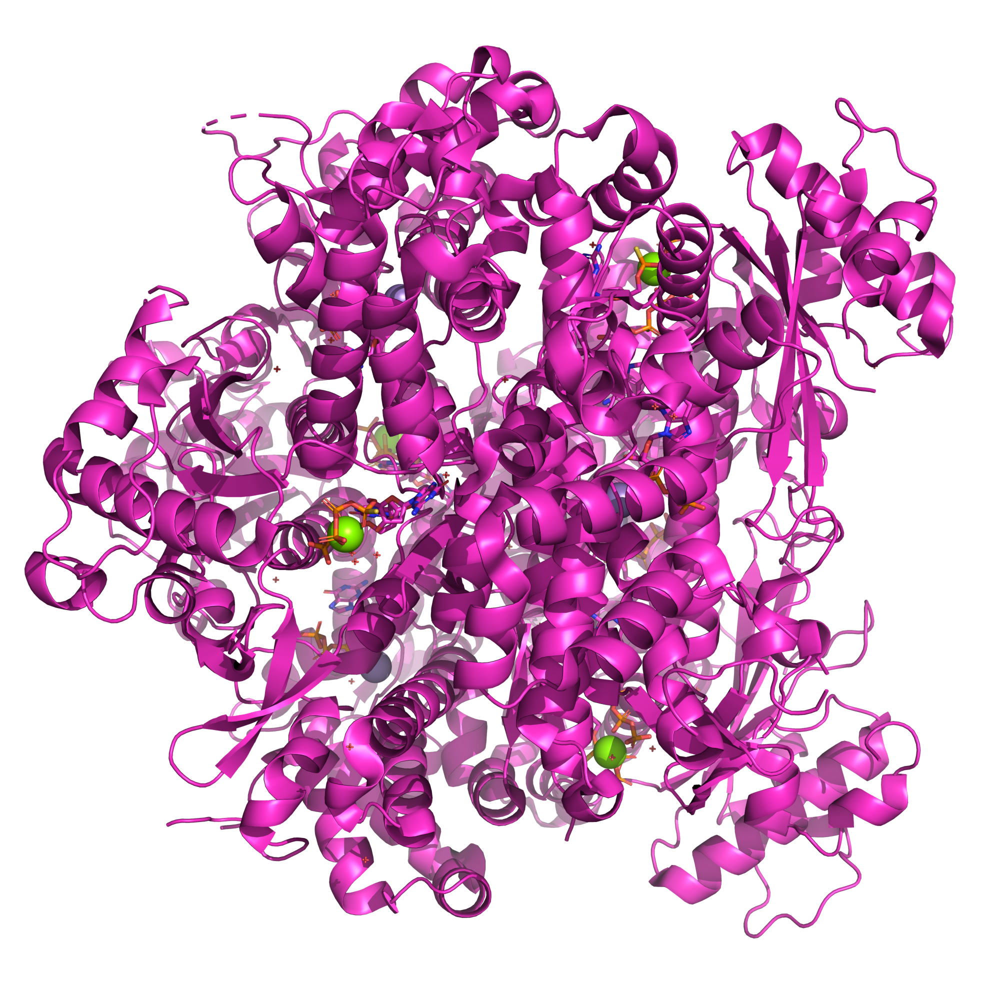
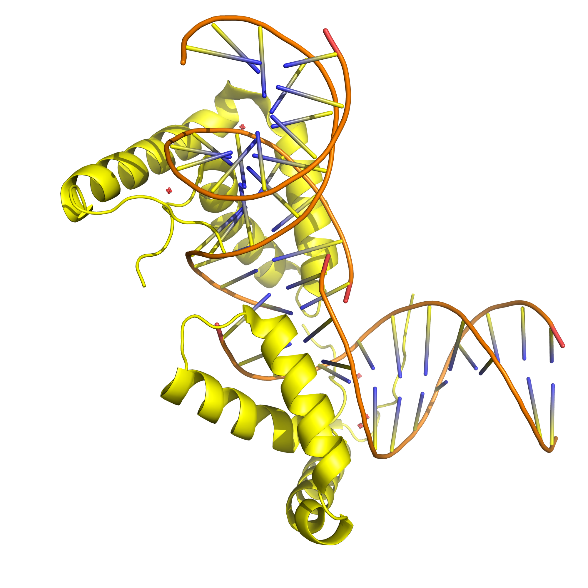
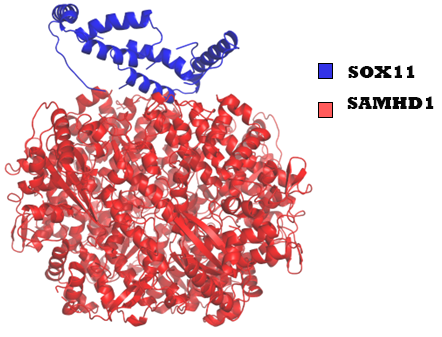
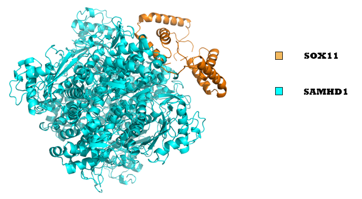

# 🧬 SAMHD1–SOX11 Docking Analysis using HADDOCK

This repository contains an in-depth structural analysis of the protein–protein interaction between **SAMHD1** and **SOX11**, using docking simulations performed via the **HADDOCK** webserver. Two docking approaches were used:
- **Random ligand placement**
- **Centroid-restrained docking**

---

## 📌 Project Goals

- Model SAMHD1–SOX11 complexes using HADDOCK
- Compare docking performance between random and centroid-based placements
- Visualize unbound and docked structures
- Assess binding quality via BSA, electrostatic/VdW energies, and Z-scores

---

## 📊 Results Summary

| Cluster       | HADDOCK Score | Buried Surface Area (Ų) | Electrostatic Energy | VdW Energy | Z-Score |
|---------------|----------------|---------------------------|----------------------|------------|---------|
| Random (200)  | -110.2         | 1622.4                    | -124.7               | -44.3      | -1.9     |
| Center (361)  | -98.4          | 1450.1                    | -110.3               | -41.8      | -1.3     |

---

## 🔬 Structural Visualizations

| Molecule               | View                                               |
|------------------------|----------------------------------------------------|
| SAMHD1 (Unbound)       |               |
| SOX11 (Unbound)        |                 |
| Docked Complex (Random)|   |
| Docked Complex (Centroid)|  |

---

### 🧬 Residue Mapping

> Visualizes interface residues at the predicted protein–protein contact zone.


---

## 📂 Cluster Score Tables

- [random_haddock_clusters.tsv](results/random_haddock_clusters.tsv)
- [centered_haddock_clusters.tsv](results/centered_haddock_clusters.tsv)

Each file contains:
- Cluster ID
- HADDOCK score
- Z-score
- Buried surface area (BSA, Ų)

---

## 🖥️ HADDOCK Terminal Setup

```bash
cd /C/Users/fares/HADDOCK
python2 haddock2.4.py --params job_params_SAMHD1xSOX11_center.json
python2 haddock2.4.py --params job_params_SAMHD1xSOX11_random.json
```

---

## 📁 Project Structure

```
SAMHD1-SOX11-Docking-Analysis/
├── data/
│  ├── 4bzc_SAMHD1_clean.pdb              # Cleaned SAMHD1 (chain A,B,C,D renumbered)
│  ├── 6t78_SOX11_model_clean.pdb            # Cleaned SOX11 (HMG domain, chain E)
│  ├── job_params_SAMHD1xSOX11_random.json   # HADDOCK web run config (random)
│  ├── job_params_SAMHD1xSOX11_center.json   # HADDOCK web run config (center)

├── Figures/
│   ├── SAMHD1_unbound.png
│   ├── SOX11_unbound.png
│   ├── cluster200_docking_cartoon.png
│   ├── cluster361_docking_cartoon.png
│   └── pdbsum_cluster361_interactions.png
├── results/
│   ├── random_haddock_clusters.tsv
│   └── centered_haddock_clusters.tsv
├── src/
│   └── prepare_structures_and_docking.md
├── README.md
├── LICENSE
└── .gitignore
```

---

## 👨‍💻 Author

**Fares Ibrahim**  
Bioinformatician | Molecular Docking | Structural Biology  
🔗 [LinkedIn](https://www.linkedin.com) | 🌐 [GitHub](https://github.com/Fares77-a11y)
